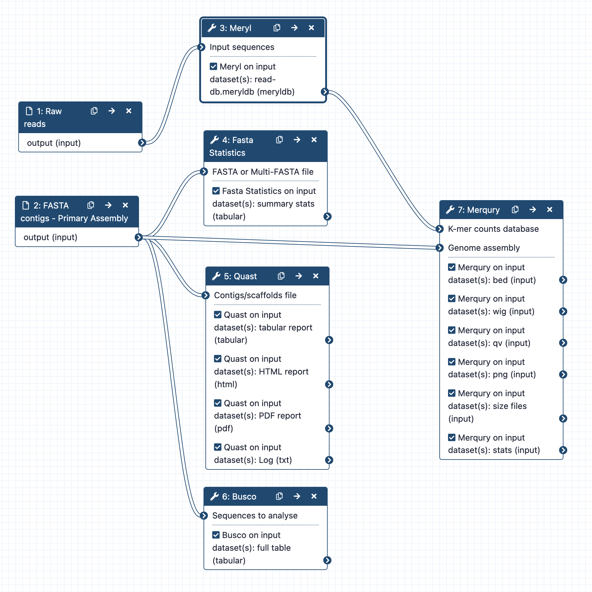

Genome assessment post assembly
===========

  - [Description](#description)
  - [Diagram](#diagram)
  - [User guide](#user-guide)
      - [Quick start guide](#quick-start-guide)
  - [Help/FAQ/Troubleshooting](#helpfaqtroubleshooting)
  - [Licence(s)](#licences)
  - [Acknowledgements/citations/credits](#acknowledgementscitationscredits)

---

# Description

Once a genome has been assembled, it is important to assess the quality of the assembly, and in the first instance, this quality control (QC) can be achieved using this workflow: more details can be found in [the How-to Guide](https://australianbiocommons.github.io/how-to-guides/genome_assembly/assembly_qc).

---

# Diagram

---

# User guide

Please see the [Genome assessment post assembly](https://australianbiocommons.github.io/how-to-guides/genome_assembly/assembly_qc) guide.

---

# Help / FAQ / Troubleshooting

---

# [License(s)](./LICENSE)

---

# Acknowledgements/citations/credits

The workflow & the [doc_guidelines template](https://github.com/AustralianBioCommons/doc_guidelines) used are supported by the Australian BioCommons via Bioplatforms Australia funding, the Australian Research Data Commons (https://doi.org/10.47486/PL105) and the Queensland Government RICF programme. Bioplatforms Australia and the Australian Research Data Commons are enabled by the National Collaborative Research Infrastructure Strategy (NCRIS).

---
